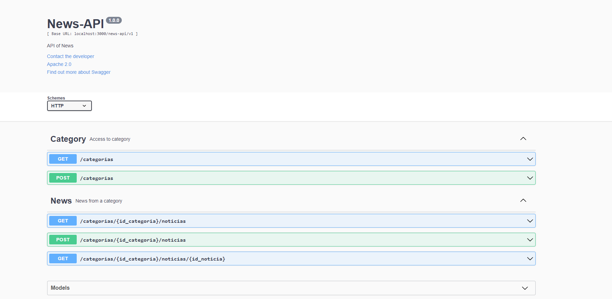

<h1 align="center">
    News API
</h1>

## 💻 Sobre o projeto

Projeto desenvolvido como trabalho no HiringCoders Gama Academy VTEX.
Desenvolver uma api de noticias utilizando o banco de dados MySQL.


---

## 🛠 Tecnologias/Ferramentas

As seguintes ferramentas foram usadas na construção do projeto:

- NodeJs
- JavaScript
- MySql
- SQL
- Express
- Swagger

---

## 🚀 Melhorias

As seguintes melhorias precisam ser feitas para aprimoramento do projeto

Principais Pontos de Melhoria:
 - Implementação de notificações também para o usuário que fez o agendamento
 - Incorporar a api a um sistema de jornal
 - Criar endpoint de update de noticias e categorias
 - Criar ordenação e paginação das listagens de noticias e categorias
 - Criar uma avaliação para a noticia

---

## 🚀 Documentação

Essa API foi documentada em Swagger para facilitar o uso de terceiros, segue abaixo uma imagem mostrando o painel de uso do swagger.



Para acessar basta utilizar o endpoint ```/api-docs```.

---

## 🦸 Autor

Desenvolvido por Hamilton Lopes ✌ [Entre em contato!](https://www.linkedin.com/in/hamilton-lopes/)
